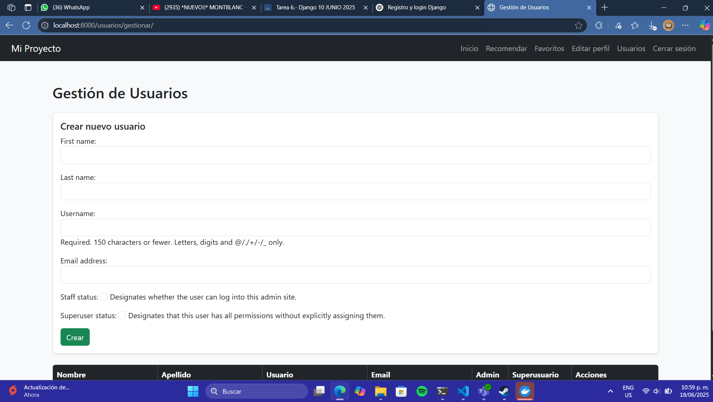

# Proyecto Django: Recomendador de Videojuegos con Panel de Usuarios

Este proyecto es una plataforma web desarrollada en Django 5.2 que permite a los usuarios:

- Registrarse, iniciar sesión y editar su perfil.
- Subir una imagen de perfil.
- Buscar y recomendar videojuegos mediante la API de RAWG.
- Guardar juegos favoritos en su cuenta.
- Ver sugerencias aleatorias desde la página de inicio.
- Gestionar usuarios (solo admin): crear, editar, eliminar, asignar roles.

---

## Tecnologías utilizadas

- Python 3.12
- Django 5.2
- Bootstrap 5.3 (CDN)
- API RAWG.io para recomendaciones
- Docker (opcional)

---

## Instalación local

### 1. Clonar el repositorio

```bash
git clone https://github.com/tu_usuario/proyecto_django.git
cd proyecto_django
```

### 2. Crear entorno virtual e instalar dependencias

```bash
python -m venv env
source env/bin/activate  # En Windows: env\Scripts\activate
pip install -r requirements.txt
```

### 3. Configurar base de datos y migraciones

```bash
python manage.py makemigrations
python manage.py migrate
```

### 4. Crear superusuario

```bash
python manage.py createsuperuser
```

### 5. Ejecutar servidor

```bash
python manage.py runserver
```

---

## Uso en Docker (opcional)

### 1. Crear requirements.txt si no existe

```bash
pip freeze > requirements.txt
```

### 2. Construir la imagen

```bash
docker-compose build
```

### 3. Levantar el contenedor

```bash
docker-compose up
```

---

## Capturas de pantalla

### Descarga del Framework


### Registro


### Login


### Perfil con imagen


### Recomendaciones


### Favoritos


### Edición de perfil


### Administración de usuraios



---

## Créditos

Proyecto creado por López Garduño Isacc como entrega escolar. API de videojuegos por RAWG.

---

## Licencia

Este proyecto se entrega bajo fines educativos. Puedes adaptarlo libremente.

